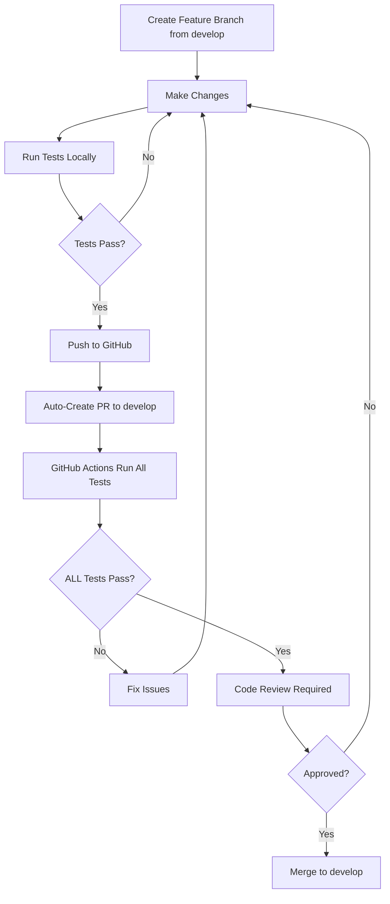

# 🔒 UNSHAKEABLE RULES - OrderNimbus Repository

**These rules are MANDATORY and NON-NEGOTIABLE. No exceptions.**

## 1. ❌ NO DIRECT COMMITS TO PROTECTED BRANCHES

- **NEVER** commit directly to `main`, `develop`, `staging`, or `production`
- **ALL** changes MUST go through a Pull Request
- **NO EXCEPTIONS** - not even for "quick fixes" or "emergencies"

## 2. 🔄 AUTOMATIC PR CREATION TO DEVELOP BRANCH

- **EVERY** code change automatically creates a PR to the `develop` branch
- Feature branches MUST be created from `develop`
- PRs merge to `develop` first, then `develop` → `staging` → `production`

## 3. ✅ ALL TESTS MUST PASS - NO EXCEPTIONS

**A PR CANNOT be merged if ANY test fails:**

| Test Suite | Status Required | Blocking |
|------------|----------------|----------|
| Unit Tests | ✅ PASS | YES |
| Backend Tests | ✅ PASS | YES |
| Frontend Tests | ✅ PASS | YES |
| E2E Tests | ✅ PASS | YES |
| Integration Tests | ✅ PASS | YES |
| Security Scan | ✅ PASS | YES |
| Code Quality | ✅ PASS | YES |

**If ANY test shows ❌ FAIL → PR is BLOCKED**

## 4. 🚫 FORBIDDEN ACTIONS

1. **Force pushing** to protected branches → FORBIDDEN
2. **Bypassing PR checks** → FORBIDDEN
3. **Merging with failing tests** → FORBIDDEN
4. **Disabling tests** to make them pass → FORBIDDEN
5. **Admin override** of protection rules → FORBIDDEN
6. **Direct database modifications** in production → FORBIDDEN
7. **Hardcoded credentials** in code → FORBIDDEN
8. **Console.log** statements in production code → FORBIDDEN

## 5. 📋 MANDATORY PR WORKFLOW



## 6. 🔐 BRANCH HIERARCHY

```
production (most protected)
    ↑
  staging
    ↑
  develop (default target for PRs)
    ↑
feature/UC###-* (all feature branches)
```

## 7. 🤖 AUTOMATED ENFORCEMENT

### GitHub Actions (`.github/workflows/pr-tests.yml`)
- Runs on EVERY pull request
- ALL 7 test suites must pass
- Cannot be skipped or bypassed

### Branch Protection Rules
```yaml
develop:
  - Require pull request reviews: 1
  - Require status checks to pass
  - Require branches to be up to date
  - Include administrators
  - Restrict force pushes

staging:
  - Require pull request reviews: 1
  - Must be ahead of develop
  - All tests must pass

production:
  - Require pull request reviews: 2
  - Must be ahead of staging
  - All tests must pass
  - Restrict who can merge
```

### Git Hooks (Husky)
- **pre-commit**: Checks for secrets and console.logs
- **pre-push**: Runs tests based on target branch

## 8. 🚨 VIOLATION CONSEQUENCES

Violations of these rules will result in:
1. **Immediate PR rejection**
2. **Automated rollback** if somehow merged
3. **Audit log entry** for compliance
4. **Required retrospective** for process improvement

## 9. 📝 COMMIT MESSAGE FORMAT

All commits MUST follow this format:
```
<type>(<scope>): <subject>

<body>

<footer>
```

Types: `feat`, `fix`, `docs`, `style`, `refactor`, `test`, `chore`

## 10. 🎯 USE CASE BASED DEVELOPMENT

- **EVERY** feature must have a Use Case ID (UC###)
- **EVERY** UC must have tests BEFORE implementation
- **EVERY** PR title must include the UC###

## ENFORCEMENT CHECKLIST

Before ANY merge to develop:
- [ ] PR created (not direct commit)
- [ ] All 7 test suites passing
- [ ] No console.log statements
- [ ] No hardcoded credentials
- [ ] Code review completed
- [ ] UC### referenced in PR
- [ ] Documentation updated
- [ ] No force push used

## EMERGENCY PROTOCOL

Even in emergencies:
1. Create hotfix branch from production
2. Fix the issue
3. Create PR with expedited review
4. ALL TESTS MUST STILL PASS
5. Merge only after approval
6. Backport to develop/staging

**NO DIRECT COMMITS EVEN IN EMERGENCIES**

---

## Signature

By working on this repository, you agree to follow these UNSHAKEABLE RULES without exception.

**These rules are enforced by:**
- GitHub Actions automation
- Branch protection settings
- Git hooks
- Code review requirements

**Last Updated**: 2025-08-13
**Version**: 1.0.0
**Status**: ACTIVE AND ENFORCED